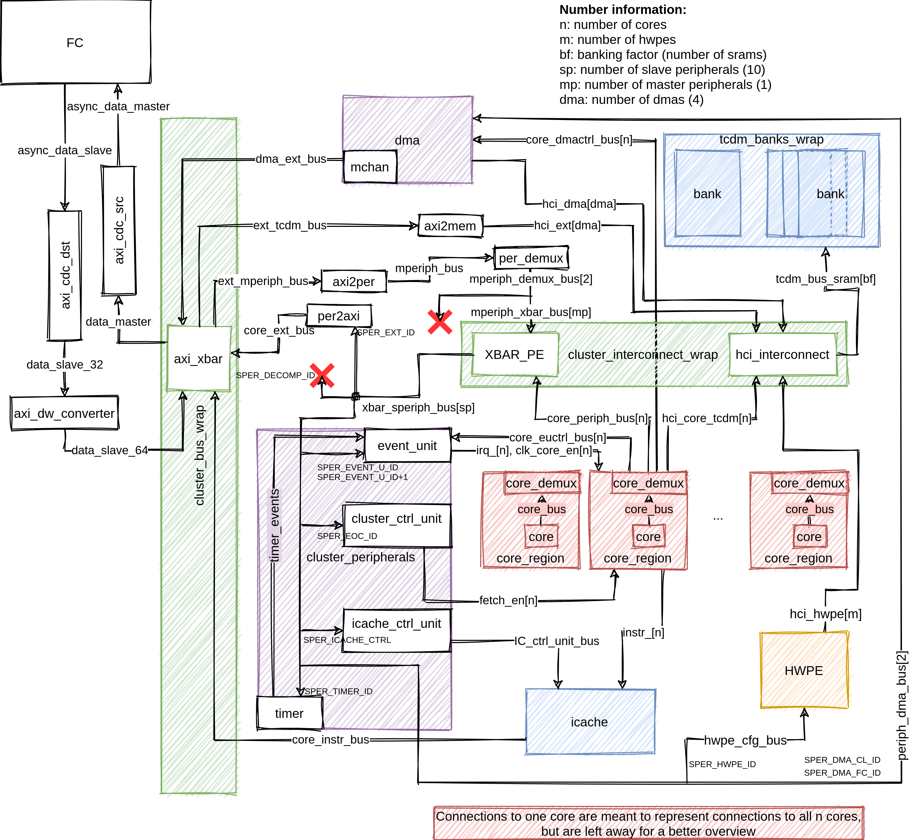

# PULP Cluster



The `pulp_cluster` repository contains the structure of the cluster subsystem used in PULP chips.
For more details on the internal architecture, see the README.md in the
[`pulp` repository](https://github.com/pulp-platform/pulp).

The [`doc`](doc/) folder contains the draw.io schematic shown above, as well as the raw source to allow for updates, outlining the most important components in pulp_cluster, as well as the communication interfaces connecting these. While not a complete overview of all signals, this is meant as a slightly more detailed overview that can assist in development. Please be aware that the schematic may not be 100% accurate.

## Simulation

It is possible to run benchmarks on the cluster, either within [PULP](https://github.com/pulp-platform/pulp) or as a separate IP. For simulation within PULP, you can directly go to the PULP repo and follow the README.

To simulate the cluster on its own, you can perform the following steps:

1. Compile the hw:
    ```
    bender update
    make scripts/compile.tcl
    make build
    ```

2. Compile the sw:
    a. clone the `pulp-runtime` with `git clone https://github.com/pulp-platform/pulp-runtime -b lv/pulp_cluster`
    b. export the path to Questasim's work directory with `source scripts/vsim.sh`
    c. choose `pulp_cluster` as target for the `pulp-runtime` with `source configs/pulp_cluster.sh`

3. Run the tests:
    a. clone the `regression_tests` with `git clone https://github.com/pulp-platform/regression_tests`
    b. choose any test among the `parallel_bare_tests` and the `mchan_tests`, move into the related folder and do `make clena all run`
