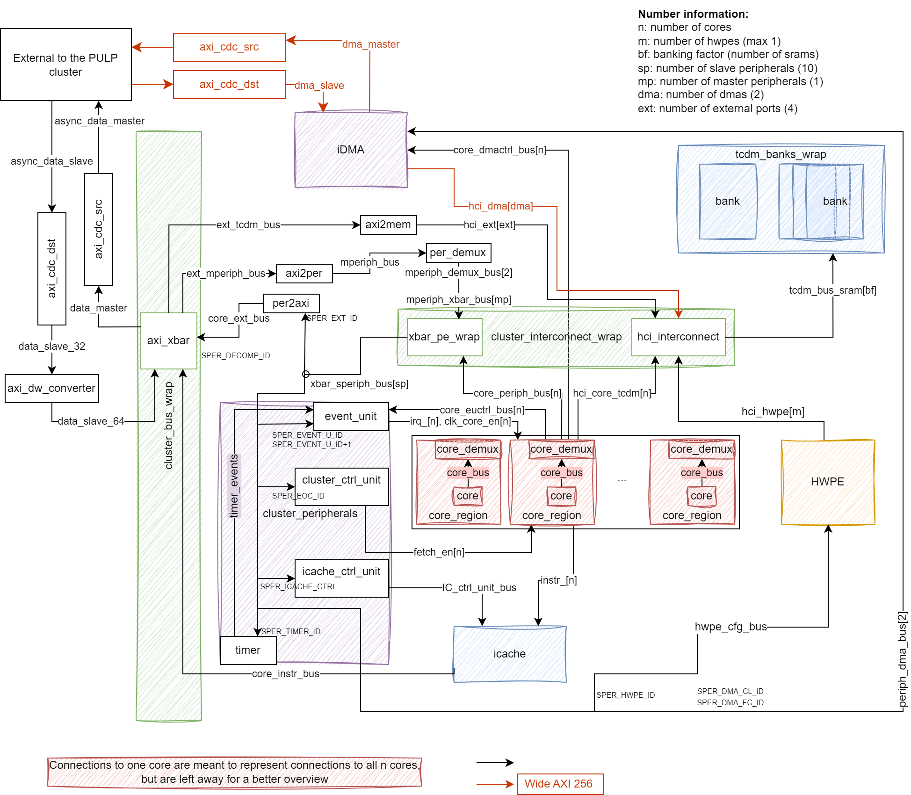

# PULP Cluster



The `pulp_cluster` repository contains the structure of the cluster subsystem
used in PULP chips. For more details on the internal architecture, see the
README.md in the [`pulp` repository](https://github.com/pulp-platform/pulp).

The [`doc`](doc/) folder contains the draw.io schematic shown above, as well as
the raw source to allow for updates, outlining the most important components in
pulp_cluster, as well as the communication interfaces connecting these. While
not a complete overview of all signals, this is meant as a slightly more
detailed overview that can assist in development. Please be aware that the
schematic may not be 100% accurate.

## Dependencies

To *build* the cluster, you will need:

   - Bender `>= 0.24.0`
   - GNU Make `>= 3.82`
   - Python `>= 3.9`
   - RISCV GCC `>= 11.2.0`

We use [Bender](https://github.com/pulp-platform/bender) for hardware IP and dependency management; for more information on using Bender, please see its documentation. You can install Bender directly through the Rust package manager Cargo:

```
cargo install bender
```

## Simulation

It is possible to run benchmarks on the cluster, either within
[PULP](https://github.com/pulp-platform/pulp) or as a separate IP. For
simulation within PULP, you can directly go to the PULP repo and follow the
README.

To simulate the cluster on its own, you can perform the following steps:

Warning: requires QuestaSim 2022.3 or newer.

1. Make sure the PULP RV32 toolchain is in your `PATH`. Please refer to [PULP
   RISCV GCC toolchain](https://github.com/pulp-platform/pulp-riscv-gcc) to use
   a pre-built release. (At IIS, this is set up by the env script in step 4.)

2. Compile the hw:
   ```
   make checkout
   make scripts/compile.tcl
   make build
   ```

3. Download the sw stack and bare-metal tests:
	```
	make pulp-runtime
	make regression_tests
	```

4. Source the environment:
   ```
   source env/env.sh
   ```

5. Run the tests. Choose any test among the `parallel_bare_tests` and the
   `mchan_tests`, move into the related folder and do:

   ```
   make clean all run
   ```

   To use the GUI, add `gui=1` to the previous command.
